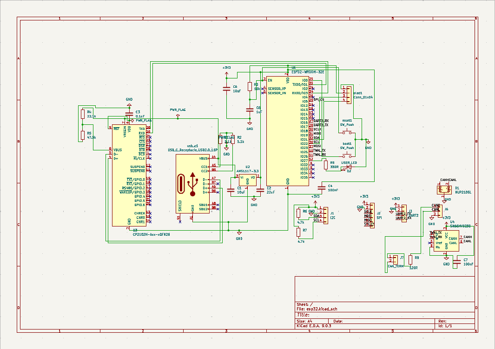
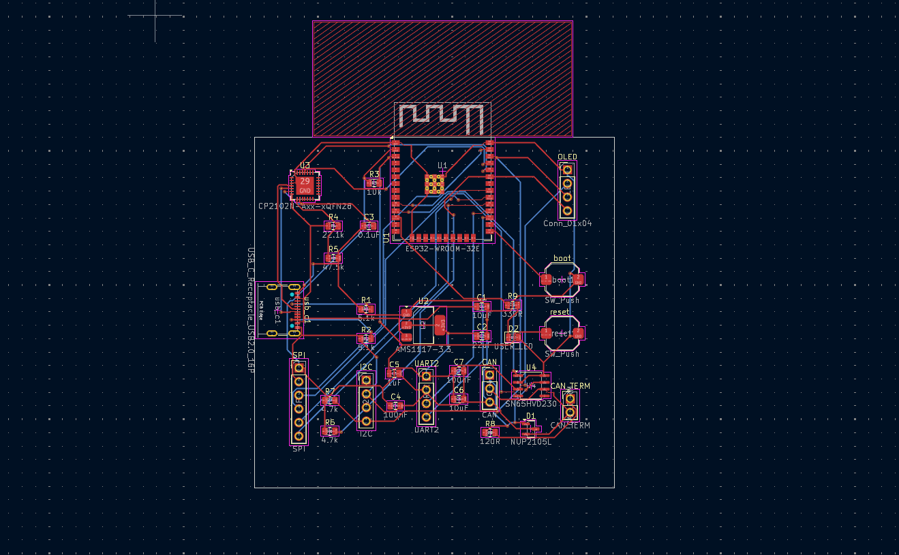
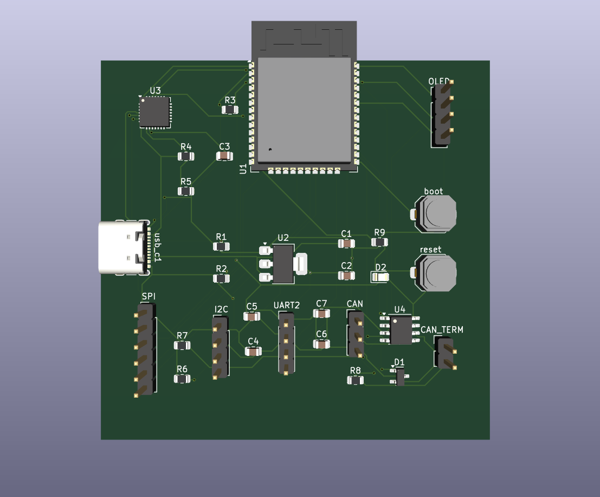
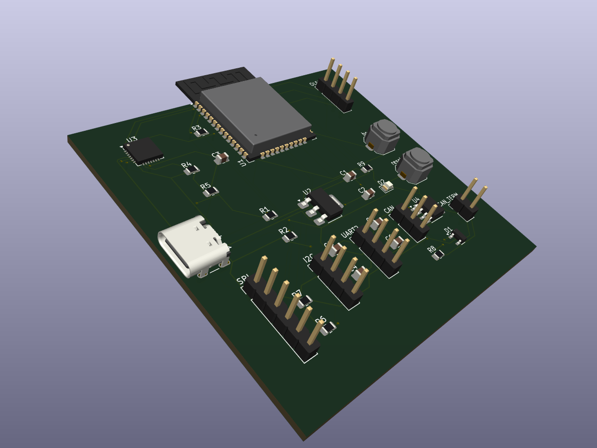

# ESP32 Custom Development Board

> A custom two-layer ESP32 development board designed from schematic to PCB layout in KiCad.

## Overview

This project is a custom ESP32 development board designed to consolidate common development and communication interfaces into a single PCB.

The design was developed in KiCad, covering the complete PCB design workflow from schematic capture and component selection to PCB placement, routing, design-rule checking, and 3D visualization.

## Features

- **ESP32-WROOM-32E** wireless microcontroller
- **USB-C** power and programming interface
- **CP2102N** USB-to-UART bridge
- **0.96" OLED** display interface
- **CAN** communication interface
- **UART2** interface
- **SPI** interface
- **I2C** interface
- **3.3 V power regulation** using AMS1117
- Dedicated **Boot** and **Reset** controls
- **User status LED**
- **CAN termination** support
- On-board power filtering and decoupling

## Design Workflow

### 1. Schematic Design

The circuit was designed and interconnected in KiCad before transferring the design to the PCB layout.



### 2. PCB Layout & Routing

Components were placed and routed on a two-layer PCB with attention to signal connectivity, component accessibility, and board organization.



### 3. 3D Visualization

KiCad's 3D Viewer was used to verify component placement and visualize the final board assembly.





## Hardware Architecture

| Section | Implementation |
|---|---|
| MCU | ESP32-WROOM-32E |
| USB Interface | USB-C + CP2102N |
| Power | AMS1117-3.3 V regulator |
| Display | OLED interface |
| CAN | SN65HVD230 transceiver |
| Serial | UART2 |
| Digital Interfaces | SPI, I2C |
| User Controls | Boot & Reset |
| Indicator | User LED |
| PCB | 2-layer |

## Tools

- **KiCad 9.0**
- Schematic Editor
- PCB Editor
- KiCad 3D Viewer

## Repository Contents

```text
├── images/
│   ├── schematic.png
│   ├── pcb-layout.png
│   ├── 3d-top.png
│   └── 3d-angle.png
│
├── esp32.kicad_pro
├── esp32.kicad_sch
└── esp32.kicad_pcb
